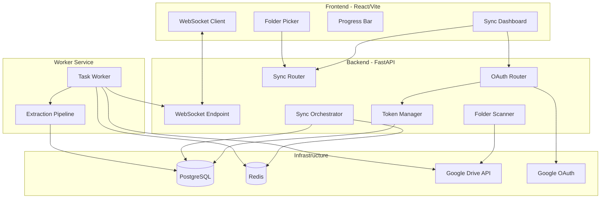

# Design Document: Google Drive Sync

## Overview

This feature adds Google Drive integration to the Starlink application, enabling users to connect their Google Drive via OAuth 2.0, select a folder, and bulk-import all PDF datasheets into the existing product extraction pipeline. The system downloads PDFs, extracts product specs via pdfplumber + LLM, and stores results in the Products table — all asynchronously with real-time WebSocket progress updates.

The design introduces a Redis-backed task queue for background processing, a dedicated worker service, and new database tables for token management and batch job tracking. The frontend gains a Sync Dashboard with live progress indicators.

## Architecture



### Key Design Decisions

1. **Separate worker process** — PDF extraction is CPU/IO-heavy and involves LLM calls. A dedicated worker prevents blocking the API server. Both services share the same codebase but run different entry points.

2. **Redis as message broker** — Lightweight, already well-supported in the Python ecosystem. We use a simple list-based queue with `BRPOP` for reliable consumption, avoiding the complexity of Celery or RabbitMQ.

3. **Fernet symmetric encryption for tokens** — The `cryptography` library's Fernet scheme provides authenticated encryption with a single key, suitable for encrypting refresh tokens at rest.

4. **WebSocket per-user channels** — Each authenticated user gets a dedicated WebSocket connection for receiving progress events. The worker publishes to Redis pub/sub, and the API server forwards to the correct WebSocket.

5. **Reuse existing extraction pipeline** — `pdf_converter.py` already handles PDF → markdown → LLM → structured specs. The worker calls the same functions, adding only the Google Drive download step.

## Components and Interfaces

### Backend Components

#### 1. OAuth Router (`backend/src/app/routers/drive_sync.py`)

Handles the OAuth 2.0 flow:

```python
# Endpoints:
# GET  /api/drive/auth/url       → Generate consent URL
# GET  /api/drive/auth/callback  → Handle OAuth callback
# POST /api/drive/auth/disconnect → Revoke and delete tokens
# GET  /api/drive/auth/status    → Check connection status
```

#### 2. Token Manager (`backend/src/services/drive/token_manager.py`)

Manages encrypted token storage and refresh:

```python
class TokenManager:
    TOKEN_EXPIRY_BUFFER = timedelta(minutes=5)  # Refresh 5 min before actual expiry
    
    async def store_tokens(self, user_id: str, access_token: str, refresh_token: str, expires_at: datetime) -> None
    async def get_valid_token(self, user_id: str) -> str  # Returns valid access_token; refreshes if expires within 5 min
    async def delete_tokens(self, user_id: str) -> None
    async def is_connected(self, user_id: str) -> bool
    def encrypt_token(self, plaintext: str) -> str
    def decrypt_token(self, ciphertext: str) -> str
    
    def _is_token_expired(self, expires_at: datetime) -> bool:
        """Check if token expires within buffer window (5 min)."""
        return expires_at < (datetime.now(timezone.utc) + self.TOKEN_EXPIRY_BUFFER)
```

#### 3. Folder Scanner (`backend/src/services/drive/folder_scanner.py`)

Recursively discovers PDFs in a Google Drive folder:

```python
class FolderScanner:
    async def validate_folder(self, user_id: str, folder_id: str) -> bool
    async def scan_folder(self, user_id: str, folder_id: str, on_progress: Callable) -> list[DriveFile]
```

#### 4. Sync Orchestrator (`backend/src/services/drive/sync_orchestrator.py`)

Creates batch jobs and dispatches tasks to Redis:

```python
class SyncOrchestrator:
    async def start_sync(self, user_id: str, folder_id: str) -> BatchJob
    async def get_job_status(self, job_id: str) -> BatchJobStatus
    async def get_job_history(self, user_id: str) -> list[BatchJob]
```

#### 5. Task Worker (`backend/src/workers/drive_worker.py`)

Consumes tasks from Redis and processes PDFs:

```python
MAX_FILE_SIZE = 100 * 1024 * 1024  # 100MB — skip files larger than this
TMP_DIR = Path("data/tmp")  # Docker volume mount for temp files

class DriveTaskWorker:
    async def run(self) -> None  # Main loop: BRPOP from queue, process
    async def process_task(self, task: SyncTask) -> None
    async def handle_failure(self, task: SyncTask, error: Exception, attempt: int) -> None
    
    async def download_file_streaming(self, access_token: str, file_id: str, dest_path: Path) -> Path:
        """Stream-download PDF in chunks to disk (never hold full file in RAM)."""
        # Uses httpx streaming response, writes 64KB chunks to disk
        # Raises if file exceeds MAX_FILE_SIZE
        ...
    
    async def process_and_cleanup(self, task: SyncTask) -> None:
        """Download, extract, and ALWAYS delete temp file in finally block."""
        tmp_path = TMP_DIR / f"{task.task_id}.pdf"
        try:
            await self.download_file_streaming(token, task.drive_file_id, tmp_path)
            # Invoke existing extraction pipeline (pdf_to_markdown + LLM)
            ...
        finally:
            # CRITICAL: Always delete temp file to prevent disk fill-up
            if tmp_path.exists():
                os.remove(tmp_path)
```

#### 6. Progress Notifier (`backend/src/services/drive/progress_notifier.py`)

Publishes progress events via Redis pub/sub. Uses `redis.asyncio` to ensure events reach all FastAPI workers (not just the one where the WebSocket is connected):

```python
class ProgressNotifier:
    """
    Multi-worker safe: Worker publishes to Redis Pub/Sub channel.
    Each FastAPI process runs a background listener that forwards
    events to locally-connected WebSocket clients.
    """
    async def publish(self, user_id: str, event: dict) -> None:
        """Publish event to Redis channel 'drive_sync:progress:{user_id}'."""
        ...
    
    async def notify_task_update(self, user_id: str, event: TaskUpdateEvent) -> None
    async def notify_batch_complete(self, user_id: str, event: BatchCompleteEvent) -> None


class WebSocketManager:
    """
    Runs in each FastAPI worker. Subscribes to Redis Pub/Sub and
    forwards events to WebSocket connections managed by THIS process.
    """
    async def start_listener(self) -> None:
        """Background task: subscribe to Redis, forward to local WS clients."""
        ...
    async def register(self, user_id: str, websocket: WebSocket) -> None
    async def unregister(self, user_id: str) -> None
```
    async def notify_batch_complete(self, user_id: str, event: BatchCompleteEvent) -> None
```

### Frontend Components

#### 1. Sync Dashboard (`frontend/src/pages/DriveSyncPage.tsx`)

Main page with connection status, folder selection, job history, and active sync progress.

#### 2. Google Connection Card (`frontend/src/components/drive/GoogleConnectionCard.tsx`)

Displays OAuth connection status with Sign In / Disconnect buttons.

#### 3. Folder Picker (`frontend/src/components/drive/FolderPicker.tsx`)

Text input for Google Drive folder ID with validation feedback.

#### 4. Sync Progress (`frontend/src/components/drive/SyncProgress.tsx`)

Real-time progress bar and per-file status list, powered by WebSocket events.

#### 5. Job History Table (`frontend/src/components/drive/JobHistory.tsx`)

Historical sync jobs with status, counts, and timestamps.

## Data Models

### New Database Tables

#### `drive_tokens` — Stores encrypted Google OAuth tokens per user

```sql
CREATE TABLE drive_tokens (
    id UUID PRIMARY KEY DEFAULT gen_random_uuid(),
    user_id VARCHAR NOT NULL UNIQUE REFERENCES users(id) ON DELETE CASCADE,
    access_token TEXT NOT NULL,
    refresh_token_encrypted TEXT NOT NULL,
    token_expires_at TIMESTAMPTZ NOT NULL,
    google_email VARCHAR,
    folder_id VARCHAR,
    is_connected BOOLEAN NOT NULL DEFAULT TRUE,
    created_at TIMESTAMPTZ NOT NULL DEFAULT NOW(),
    updated_at TIMESTAMPTZ NOT NULL DEFAULT NOW()
);

CREATE INDEX idx_drive_tokens_user_id ON drive_tokens(user_id);
```

#### `batch_jobs` — Tracks sync batch jobs

```sql
CREATE TABLE batch_jobs (
    id UUID PRIMARY KEY DEFAULT gen_random_uuid(),
    user_id VARCHAR NOT NULL REFERENCES users(id) ON DELETE CASCADE,
    folder_id VARCHAR NOT NULL,
    status VARCHAR NOT NULL DEFAULT 'processing',  -- processing, completed, failed
    total_files INTEGER NOT NULL DEFAULT 0,
    completed_count INTEGER NOT NULL DEFAULT 0,
    failed_count INTEGER NOT NULL DEFAULT 0,
    skipped_count INTEGER NOT NULL DEFAULT 0,
    products_extracted INTEGER NOT NULL DEFAULT 0,
    started_at TIMESTAMPTZ NOT NULL DEFAULT NOW(),
    completed_at TIMESTAMPTZ,
    created_at TIMESTAMPTZ NOT NULL DEFAULT NOW()
);

CREATE INDEX idx_batch_jobs_user_id ON batch_jobs(user_id);
CREATE INDEX idx_batch_jobs_status ON batch_jobs(status);
```

#### `batch_tasks` — Individual file processing tasks within a batch

```sql
CREATE TABLE batch_tasks (
    id UUID PRIMARY KEY DEFAULT gen_random_uuid(),
    batch_job_id UUID NOT NULL REFERENCES batch_jobs(id) ON DELETE CASCADE,
    user_id VARCHAR NOT NULL REFERENCES users(id) ON DELETE CASCADE,
    drive_file_id VARCHAR NOT NULL,
    file_name VARCHAR NOT NULL,
    file_size BIGINT DEFAULT 0,
    status VARCHAR NOT NULL DEFAULT 'queued',  -- queued, processing, completed, failed, dlq
    attempt_count INTEGER NOT NULL DEFAULT 0,
    error_message TEXT,
    products_extracted INTEGER NOT NULL DEFAULT 0,
    started_at TIMESTAMPTZ,
    completed_at TIMESTAMPTZ,
    created_at TIMESTAMPTZ NOT NULL DEFAULT NOW()
);

CREATE INDEX idx_batch_tasks_batch_job_id ON batch_tasks(batch_job_id);
CREATE INDEX idx_batch_tasks_status ON batch_tasks(status);
CREATE INDEX idx_batch_tasks_drive_file_id ON batch_tasks(drive_file_id);
```

### SQLAlchemy Models

```python
# backend/src/db/models/drive_sync.py

class DriveToken(SQLModel, table=True):
    __tablename__ = "drive_tokens"
    id: str = Field(default_factory=lambda: str(uuid.uuid4()), primary_key=True)
    user_id: str = Field(foreign_key="users.id", unique=True, index=True)
    access_token: str
    refresh_token_encrypted: str
    token_expires_at: datetime
    google_email: str | None = None
    folder_id: str | None = None
    is_connected: bool = Field(default=True)
    created_at: datetime = Field(default_factory=lambda: datetime.now(timezone.utc))
    updated_at: datetime = Field(default_factory=lambda: datetime.now(timezone.utc))


class BatchJob(SQLModel, table=True):
    __tablename__ = "batch_jobs"
    id: str = Field(default_factory=lambda: str(uuid.uuid4()), primary_key=True)
    user_id: str = Field(foreign_key="users.id", index=True)
    folder_id: str
    status: str = Field(default="processing")
    total_files: int = Field(default=0)
    completed_count: int = Field(default=0)
    failed_count: int = Field(default=0)
    skipped_count: int = Field(default=0)
    products_extracted: int = Field(default=0)
    started_at: datetime = Field(default_factory=lambda: datetime.now(timezone.utc))
    completed_at: datetime | None = None
    created_at: datetime = Field(default_factory=lambda: datetime.now(timezone.utc))


class BatchTask(SQLModel, table=True):
    __tablename__ = "batch_tasks"
    id: str = Field(default_factory=lambda: str(uuid.uuid4()), primary_key=True)
    batch_job_id: str = Field(foreign_key="batch_jobs.id", index=True)
    user_id: str = Field(foreign_key="users.id")
    drive_file_id: str = Field(index=True)
    file_name: str
    file_size: int = Field(default=0)
    status: str = Field(default="queued")
    attempt_count: int = Field(default=0)
    error_message: str | None = None
    products_extracted: int = Field(default=0)
    started_at: datetime | None = None
    completed_at: datetime | None = None
    created_at: datetime = Field(default_factory=lambda: datetime.now(timezone.utc))
```

### Redis Queue Data Structures

**Task Queue** (`drive_sync:tasks`): Redis List

```json
{
  "task_id": "uuid",
  "batch_job_id": "uuid",
  "user_id": "user-uuid",
  "drive_file_id": "google-drive-file-id",
  "file_name": "datasheet.pdf",
  "file_size": 1048576,
  "attempt": 0
}
```

**Dead Letter Queue** (`drive_sync:dlq`): Redis List with 7-day TTL per entry via sorted set

```json
{
  "task_id": "uuid",
  "batch_job_id": "uuid",
  "user_id": "user-uuid",
  "drive_file_id": "google-drive-file-id",
  "file_name": "datasheet.pdf",
  "error": "Extraction failed: ...",
  "failed_at": "2024-01-15T10:30:00Z",
  "original_payload": { ... }
}
```

**Progress Pub/Sub Channel** (`drive_sync:progress:{user_id}`): Redis Pub/Sub

### WebSocket Event Schema

```typescript
// Task progress event
interface TaskUpdateEvent {
  type: "task_update";
  batch_job_id: string;
  task_id: string;
  status: "queued" | "processing" | "completed" | "failed";
  file_name: string;
  progress: {
    completed: number;
    failed: number;
    total: number;
  };
}

// Batch completion event
interface BatchCompleteEvent {
  type: "batch_complete";
  batch_job_id: string;
  summary: {
    total_files: number;
    completed: number;
    failed: number;
    skipped: number;
    products_extracted: number;
  };
}
```

### API Endpoints

| Method | Path | Description |
|--------|------|-------------|
| GET | `/api/drive/auth/url` | Generate Google OAuth consent URL |
| GET | `/api/drive/auth/callback` | Handle OAuth callback (code exchange) |
| GET | `/api/drive/auth/status` | Check if user has active Google connection |
| POST | `/api/drive/auth/disconnect` | Revoke tokens and disconnect |
| POST | `/api/drive/sync/start` | Validate folder, scan, and start batch sync |
| GET | `/api/drive/sync/jobs` | List user's batch job history |
| GET | `/api/drive/sync/jobs/{job_id}` | Get detailed job status with task list |
| POST | `/api/drive/sync/jobs/{job_id}/retry-failed` | Retry failed tasks from DLQ |
| WS | `/api/drive/ws` | WebSocket for real-time progress updates |

## Correctness Properties

*A property is a characteristic or behavior that should hold true across all valid executions of a system — essentially, a formal statement about what the system should do. Properties serve as the bridge between human-readable specifications and machine-verifiable correctness guarantees.*

### Property 1: Consent URL correctness

*For any* user session, the generated OAuth consent URL SHALL contain the `drive.readonly` scope, `access_type=offline` parameter, and a CSRF state parameter that matches the value stored for that session.

**Validates: Requirements 1.1, 1.2**

### Property 2: CSRF state validation

*For any* OAuth callback request, the callback SHALL succeed only when the provided state parameter exactly matches the state stored for the user's session; all non-matching states SHALL result in rejection.

**Validates: Requirements 2.2, 2.3**

### Property 3: Token storage round-trip

*For any* valid token set (access_token, refresh_token, expiry, user_id), storing via Token_Manager and then retrieving SHALL produce identical values for all fields.

**Validates: Requirements 3.1**

### Property 4: Refresh token encryption round-trip

*For any* refresh token string, encrypting and then decrypting SHALL produce the original plaintext, and the encrypted form SHALL never equal the plaintext.

**Validates: Requirements 3.2**

### Property 5: Token expiry check with safety buffer

*For any* stored token record, the Token_Manager SHALL return the access_token directly when `token_expires_at` is more than 5 minutes in the future, and SHALL trigger a refresh when `token_expires_at` is within 5 minutes of the current time or in the past.

**Validates: Requirements 3.3**

### Property 6: PDF-only filtering with complete metadata

*For any* set of files returned by the Google Drive API (with mixed MIME types), the Folder Scanner SHALL return only files with MIME type `application/pdf`, and each returned file SHALL include a non-empty `file_id`, `file_name`, and a numeric `file_size`.

**Validates: Requirements 5.1, 5.3**

### Property 7: Task dispatch correctness

*For any* list of discovered PDF files, the Sync Orchestrator SHALL enqueue exactly one task per file into Redis, each task SHALL contain the file's `drive_file_id`, `file_name`, `batch_job_id`, and `user_id`, and all assigned task IDs SHALL be unique.

**Validates: Requirements 6.2, 6.3**

### Property 8: Product persistence with source reference

*For any* successful extraction result containing N products, the Task Worker SHALL save exactly N product records to the Products table, each with the source `drive_file_id` set to the originating Google Drive file.

**Validates: Requirements 7.3**

### Property 9: Dead letter queue payload preservation

*For any* task that fails after all retry attempts, the Dead Letter Queue entry SHALL contain the complete original task payload and the error message from the final failure.

**Validates: Requirements 8.2**

### Property 10: WebSocket event completeness

*For any* task status change, the emitted WebSocket event SHALL contain the `batch_job_id`, `task_id`, current `status`, and batch progress as `completed_count / total_count`.

**Validates: Requirements 9.1, 9.2**

### Property 11: Batch completion summary correctness

*For any* batch where all tasks have reached a terminal state (completed or DLQ), the batch-complete event's `success_count + failure_count` SHALL equal the total task count.

**Validates: Requirements 9.4**

### Property 12: Progress calculation

*For any* batch job state with `completed`, `failed`, and `total` counts, the displayed progress percentage SHALL equal `(completed + failed) / total * 100`.

**Validates: Requirements 10.1**

### Property 13: Duplicate file detection and exclusion

*For any* list of files to sync where some `drive_file_id` values already exist in `batch_tasks` with status "completed", those files SHALL be excluded from the new batch and the batch's `total_files` count SHALL not include them.

**Validates: Requirements 12.1, 12.2**

### Property 14: Token deletion on disconnect

*For any* user with stored tokens, after calling disconnect, the `drive_tokens` table SHALL contain no records for that user_id.

**Validates: Requirements 13.1**

## Error Handling

### OAuth Errors

| Error | Handling |
|-------|----------|
| User denies consent | Redirect to dashboard with `error=access_denied` query param; show friendly message |
| Invalid CSRF state | Return 403; log the attempt with user IP for security monitoring |
| Token exchange failure | Return 500 with message; log full error; do not store partial tokens |
| Refresh token revoked | Mark `is_connected=false`; emit WebSocket event; show reconnect prompt in UI |

### Google Drive API Errors

| Error | Handling |
|-------|----------|
| 403 Rate Limit | Exponential backoff: 1s, 2s, 4s, 8s, 16s (up to 5 retries) |
| 404 Folder Not Found | Return user-friendly error: "Folder not found or no access" |
| 401 Unauthorized | Attempt token refresh; if refresh fails, mark disconnected |
| Network timeout | Retry up to 3 times with 5s timeout per request |

### Task Worker Errors

| Error | Handling |
|-------|----------|
| PDF download fails | Retry up to 3 times with exponential backoff (2s, 4s, 8s) |
| Token expired during download | Refresh token via Token_Manager, retry download once |
| Extraction pipeline crash | Catch exception, move to DLQ with full traceback |
| Redis connection lost | Worker enters reconnect loop with 5s interval; tasks remain in queue |
| Worker process crash | Docker restart policy (`unless-stopped`) brings it back; unacknowledged tasks remain in Redis |

### Frontend Error States

- **Connection lost**: WebSocket auto-reconnects with exponential backoff (1s, 2s, 4s, max 30s)
- **API errors**: Toast notifications with descriptive messages
- **Stale data**: Polling fallback every 10s when WebSocket is disconnected

## Testing Strategy

### Property-Based Tests (using `hypothesis`)

Property-based tests validate the correctness properties defined above. Each test runs a minimum of 100 iterations with randomized inputs.

- **Library**: `hypothesis` (Python) for backend properties
- **Configuration**: Minimum 100 examples per property, deadline=None for async tests
- **Tag format**: `# Feature: google-drive-sync, Property {N}: {title}`

Target modules for PBT:
- Token Manager: encryption round-trip (Property 4), expiry logic (Property 5), storage round-trip (Property 3)
- OAuth Service: URL generation (Property 1), state validation (Property 2)
- Folder Scanner: PDF filtering (Property 6)
- Sync Orchestrator: task dispatch (Property 7), deduplication (Property 13)
- Progress Notifier: event structure (Property 10), batch summary (Property 11)
- Progress calculation: formula correctness (Property 12)

### Unit Tests (example-based)

- OAuth callback: successful exchange, failed exchange, missing state
- Token Manager: store/retrieve, disconnect clears tokens
- Folder Scanner: empty folder, folder with mixed file types, rate limit retry
- Task Worker: successful processing, retry on failure, DLQ after max retries
- API endpoints: auth required, validation errors, success responses

### Integration Tests

- Full OAuth flow with mocked Google endpoints
- End-to-end sync: mock Drive API → queue → worker → DB → WebSocket
- Redis connection/disconnection resilience
- WebSocket connection lifecycle and reconnection

### Frontend Tests

- Component rendering: Sync Dashboard states (disconnected, connected, syncing)
- WebSocket hook: connection management, event handling, reconnection
- Progress bar: correct percentage rendering from event data

## Docker Compose Changes

### New Services

```yaml
# Added to docker-compose.dev.yml and docker-compose.prod.yml

  redis:
    image: redis:7-alpine
    restart: unless-stopped
    ports:
      - "6379:6379"
    volumes:
      - redis-data:/data
    healthcheck:
      test: ["CMD", "redis-cli", "ping"]
      interval: 5s
      timeout: 3s
      retries: 5

  worker:
    build:
      context: ./backend
      dockerfile: Dockerfile.dev  # or Dockerfile for prod
    restart: unless-stopped
    command: python -m src.workers.drive_worker
    volumes:
      - ./backend/src:/app/src
      - ./backend/data:/app/data
    env_file:
      - ./backend/.env.docker
    environment:
      - ENV=development
    depends_on:
      postgres:
        condition: service_healthy
      redis:
        condition: service_healthy
```

### New Volume

```yaml
volumes:
  redis-data:
```

### Environment Variable Additions (`.env.example`)

```bash
# Google Drive OAuth
GOOGLE_CLIENT_ID=your-client-id.apps.googleusercontent.com
GOOGLE_CLIENT_SECRET=your-client-secret
GOOGLE_REDIRECT_URI=http://localhost:8030/api/drive/auth/callback

# Redis
REDIS_URL=redis://redis:6379/0

# Token encryption (generate with: python -c "from cryptography.fernet import Fernet; print(Fernet.generate_key().decode())")
TOKEN_ENCRYPTION_KEY=your-fernet-key-here
```

### New Python Dependencies

```toml
# Added to backend/pyproject.toml
"google-auth>=2.29.0",
"google-auth-oauthlib>=1.2.0",
"google-api-python-client>=2.127.0",
"cryptography>=42.0.0",
"redis[hiredis]>=5.0.0",
"hypothesis>=6.100.0",  # test dependency
```
